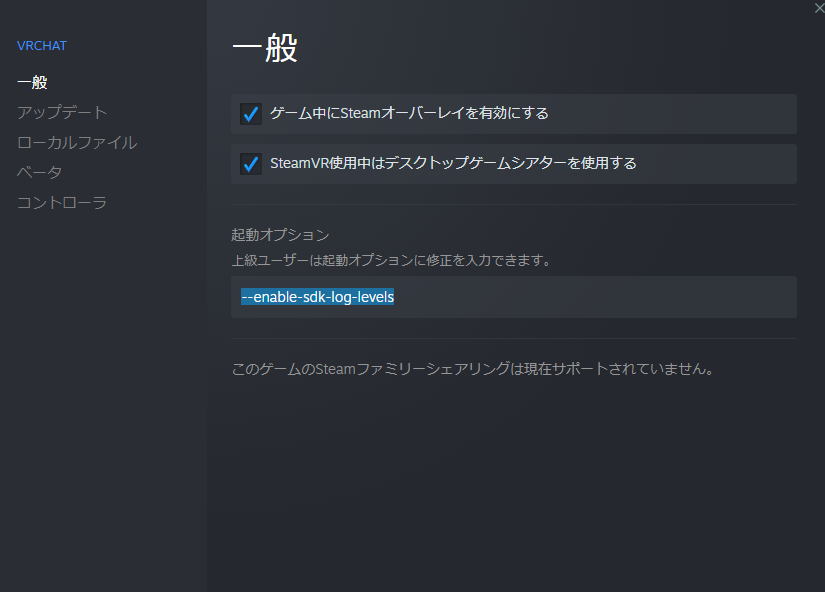

# VRCLogAnalyzer

このアプリは、VRChatのログを解析して、訪れたワールドやその場にいたユーザーのデータベースを作成するWPFアプリです。

最新バージョンのZipファイルをダウンロードし、解凍して、解凍後のフォルダにある「VRCLogAnalyzer.exe」を実行し、「設定」＞「データ更新」を選択し、VRChatのログを読み込ませるとログに記録されていたユーザーと出会いやワールド訪問の記録が確認できるようになります。インストール不要です。
※署名付きアプリではないので、起動時に警告が出ると思いますが、このアプリを信用していただけるのであれば、警告を確認の上、起動してください。

過去のバージョンのアプリを利用したい場合は、  https://github.com/sechiro/VRCLogAnalyzer/releases にすべてのリリースバージョンがあるので、そこからZipファイルをダウンロードしてください。

## 動作環境

- OS: Windows 10 （64bit）
- SteamからVRChatを起動（Oculusからの起動は未確認）
- （任意）VRChatの起動オプションに「--enable-sdk-log-levels」を追加
  - ユーザー情報とワールドの詳細をログ出力させるためのオプション追加
  - すでにほかのオプションを指定している場合は、半角スペースで区切って追加する。
  - なくても動くとの情報もあるので、現在、条件確認中です。ユーザーのプロフィールやワールドの説明書きなどは、このオプションがないと取得できないかもしれません。（ただ、特にユーザープロフィールはオプションがあっても必ずログに出るとは限らないことをご了解ください）

対応環境は、今後拡大する可能性はありますが、複数環境への対応大変なので、自分も使っている一般的なVRChat環境に限定して動作確認しています。

## 動作説明

- VRChatのデフォルトのログパスからログファイルを取得し、データベースに格納します。
- データベースファイルは、MyDocuments\VRCLogAnalyzer\VRCLogAnalyzer.dbに置かれています。
  - v0.2以前はMyDocuments直下にこのファイルが置かれていました。v0.2以前のバージョンを使っていて、データを引き継ぐ場合はお手数ですが、「VRCLogAnalyzer.db」新しい場所にコピーしてください。
- データベースはSQLite3を利用しており、SQLite3のクライアントから直接確認することも可能です。

## 操作方法

### データベースの更新

- アプリ起動後、「設定」メニューから「データの更新」を選択すると、ログからデータベースにデータが取り込まれます。
  - データベースの更新は、コマンドラインから「VRCLogAnalyzer.exe /analyze」とオプションをつけて実行することもできます。VRChatのログは、数日でローテーションして消えてしまうので、これをタスクスケジューラ等から1日1回実行するような使い方を想定しています。
  - 以下はタスクスケジューラ設定例です。

### 訪問履歴データの表示

- 自分が行ったワールドと、そこで一緒になったユーザーをその時間をとともに表示します。アプリ画面から日付、ユーザー名、ワールド名を指定し、「検索」ボタンをクリックするとそれに該当するログが表示されます。（ユーザー名、ワールド名は、部分一致検索です。大文字小文字は区別しません）
- ワールドの説明文やユーザーのプロフィールがログから取得できている場合は、マウスカーソルをかざすとその内容がポップアップされます。ただ、必ずしもこの情報がログに出るとは限らないようなので、すべては表示されないことをご了解ください。

### 収集データのエクスポート

- 収集したデータをユーザーデータ、ワールドデータに分けてCSV形式で出力できます。
  - ユーザーデータは、ユーザーと出会った（同じインスタンスに入ってユーザーを読み込んだタイミング）と、その時のワールド名、ワールドに自分が入った時間が記録されています。
  - ワールドデータは、自分が訪れたワールド名、ワールドに入った時間、ワールドの説明文などの詳細情報が記録されています。

### データ保存フォルダの変更

- データ保存フォルダは、デフォルトでは「マイドキュメント」の「VRCLogAnalyzer」フォルダに保存されます。
  - データ保存フォルダがデフォルトのままなら、アプリを更新する際、更新版のアプリのZIPを展開すればファイルの移動をしなくてもそのまま使えます。
- データ保存フォルダは、「設定」＞「データ保存場所変更」メニューから選択でき、デフォルトの「マイドキュメント」の「VRCLogAnalyzer」フォルダ以外に、アプリ実行ファイルと同じフォルダを選択できます。
  - この設定を行った場合にアプリを更新する場合は、更新前のフォルダから新しいプログラムが入ったフォルダに「VRCLogAnalyzer.db」および「VRCLogAnalyzer.config」（ファイル保存場所設定を記録したファイル）をコピー・上書きしてください。

## アプリのコンセプト

### コンセプト

- みんなが使える、安心設計のVRChat履歴アプリ
  - ローカルPCに閉じたログ解析で、VRChatに追加の負担をかけずに誰もが使える
  - シンプルで、どのような処理をしているのか明確
  - プライバシーを尊重し、ユーザーデータは必要最低限だけ

### このアプリではやらないこと

- ログ以外（VRChat APIやVRChatウェブサイトを含む）からの情報収集
  - VRChat APIは、非公式となっており、また、多くの人がAPIにアクセスすることでVRChatのサーバー側負荷が高くなってしまうおそれがあるため、ローカルPCだけで話が完結するログのみをデータソースとして利用する
  - 結果として、VRChatのIDとパスワードが必要になるようなリソースも利用しない
  - ユーザープロフィールなど、詳細情報が取れない場合もありますが、それはこのアプリのコンセプト上やむを得ないと考えています。（取れたらラッキーぐらいで考えておいてください）
- 現在表示している以上のユーザー情報の収集
  - プライバシーを考慮し、このアプリでは収集する情報はVRChat上で会ってプロフィールを確認すればわかる範囲に収集対象を限定し、表示に利用している以上のユーザー情報を収集しない
  - 何回会っているなど、フレンド管理のような機能も提供しない
- 訪問履歴以外のワールド情報の提供
  - ワールドの情報は、訪問履歴の記録のためだけに利用する。（不具合対応や今後の機能拡張に備えてワールドのID等は記録はしているが、アプリ側で直接表示する機能は設けない）
  - VRChatのワールド検索でうまくワールドが見つからないことがあるため、記録をたどれることを重視しして、エクスポート機能からワールドデータをダウンロードした際には、ワールドおよびサムネイルのURLがデータに含まれるようにしています。

----
copyright (c) sechiro 2021

本アプリは、MIT ライセンスにてGithub上で公開されています。
https://github.com/sechiro/VRCLogAnalyzer

アプリケーションのフレームワークとして、Windows Presentation Foundation (WPF)を利用しており、NETを同梱しています。
.NETは、MIT および Apache 2 ライセンスで配布されているオープンソースソフトウェアです。
https://github.com/dotnet/runtime/blob/main/LICENSE.TXT

本アプリは、VRChat社とは関係のない有志のアプリです。
また、オープンソースソフトウェアとして、AS-ISで配布され、開発者はこのソフトウェアを利用したことによるいかなる損害の責任を負いません
また、将来のVRChatの仕様変更により、本アプリが利用できなくなった場合の対応を保証するものではありません。

以上